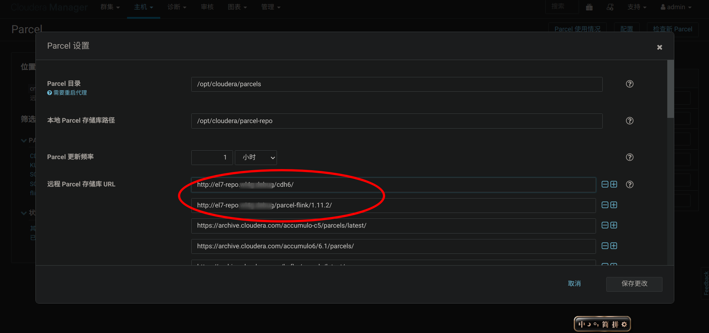
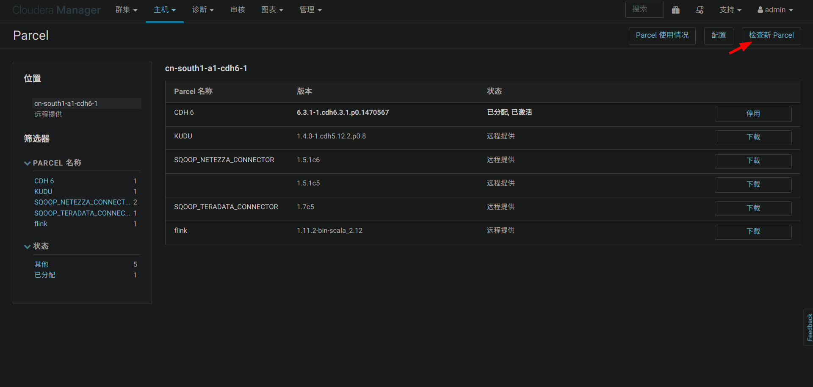
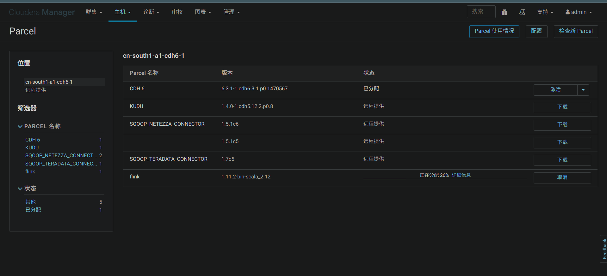
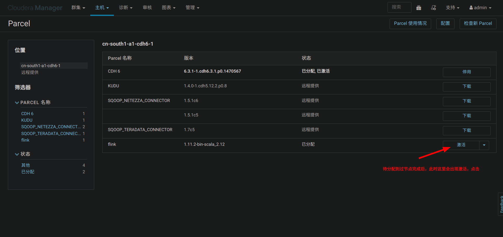
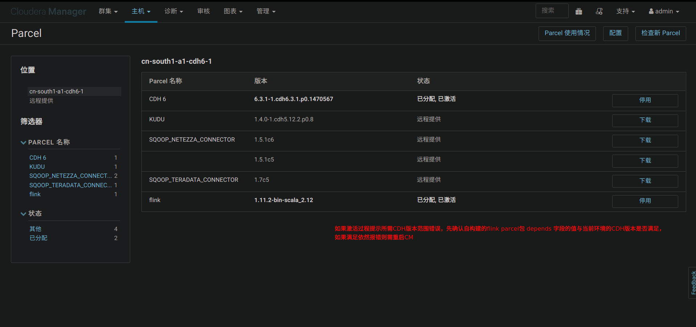
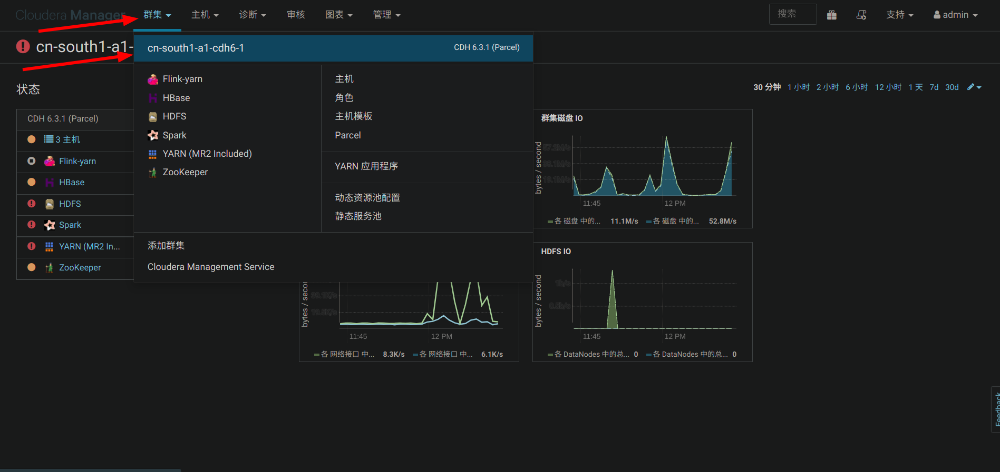
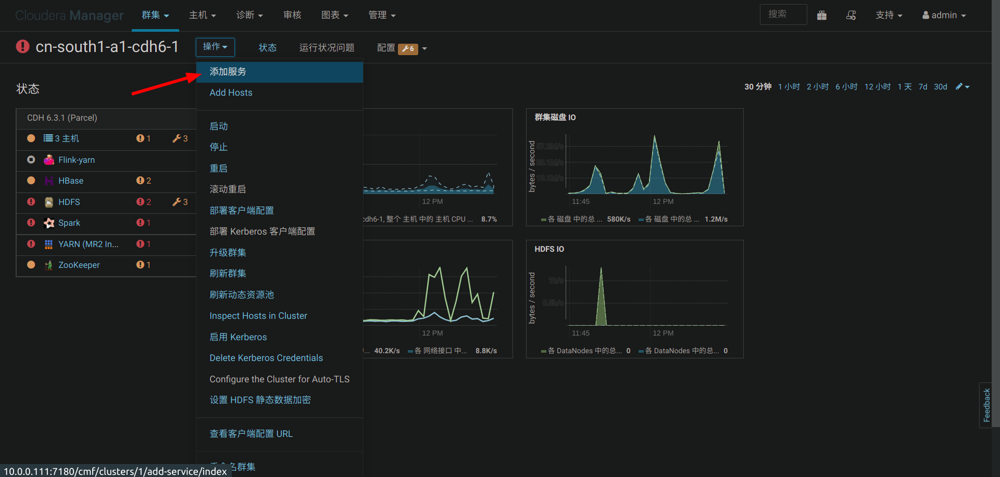
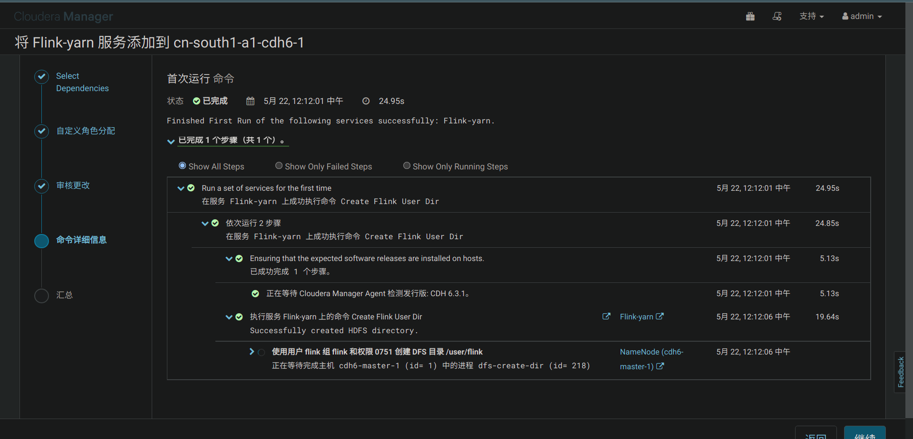
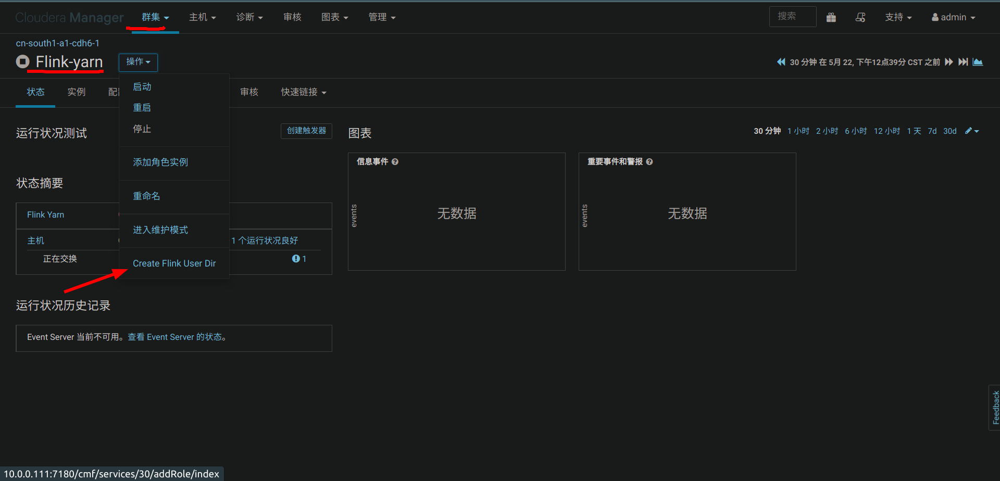
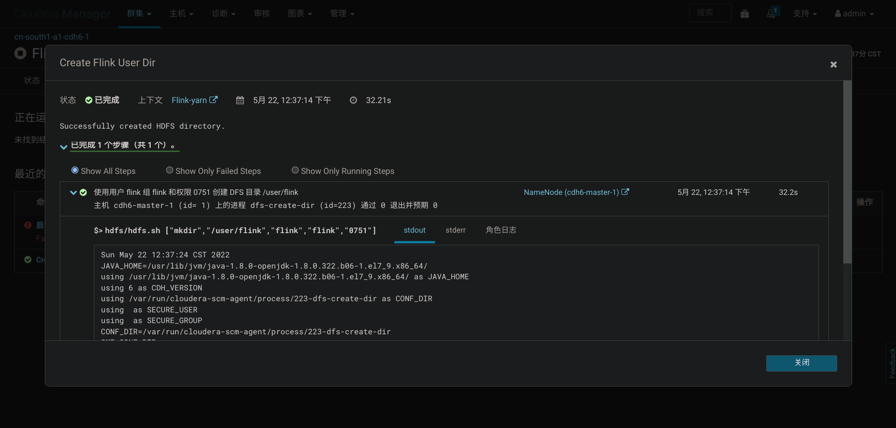

# Flink Parcel Generator

本项目 fork 自 https://github.com/gaozhangmin/flink-parcel 来修改，感谢作者的贡献。

## 导读

CDH 除了能够管理自生所提供的一些大数据相关服务外，还允许将第三方服务添加到 CDH 集群（托管在 CDH 上）。你需要做的就是按照一定的规则流程制作相关程序包，最后发布到 CDH 上。虽然过程并不困难，但是手动操作尤其是一些关键配置容易出错，往往导致最终服务无法正常在 CDH 上安装运行。

本文就是指导大家如何打包自己的服务，发布到 CDH 上，并且由 CDH 控制服务的运行、监控服务的基本运行状态。

## 1. 名词介绍

- **1.1 parcel** 以".parcel"结尾的压缩文件。parcel 包内共两个目录，其中 lib 包含了服务组件，meta 包含一个重要的描述性文件 parcel.json，这个文件记录了服务的信息，如版本、所属用户、适用的 CDH 平台版本等。

  - **命名规则必须如下**：

    - 文件名称格式为三段，第一段是包名，第二段是版本号，第三段是运行平台。

    - 如：flink-1.15.2-bin-scala_2.12-el7.parcel

  - **包名**：flink

  - **版本号**：1.15.2-bin-scala_2.12

  - **运行环境**：el7

    - el6 是代表 centos6 系统，centos7 则用 el7 表示

  - parcel 必须包置于/opt/cloudera/parcel-repo/目录下才可以被 CDH 发布程序时识别到。

- **1.2 csd**：csd 文件是一个 jar 包，它记录了服务在 CDH 上的管理规则里面包含三个文件目录，images、descriptor、scripts,分别对应。如服务在 CDH 页面上显示的图标、依赖的服务、暴露的端口、启动规则等。

  - csd 的 jar 包必须置于/opt/cloudera/csd/目录才可以在添加集群服务时被识别到。

## 2. flink parcel 包制作过程

以 CDH5.14、flink1.14.4 为例

- 2.1 **下载制作包**

```bash
git clone https://github.com/wl4g-collect/flink-parcel-generator.git
```

- 2.2 **修改配置文件**　flink-parcel.properties

```properties
## FLINK download address.
#FLINK_URL=https://mirrors.tuna.tsinghua.edu.cn/apache/flink/flink-1.9.2/flink-1.9.2-bin-scala_2.11.tgz
#FLINK_URL=https://archive.apache.org/dist/flink/flink-1.14.4/flink-1.14.4-bin-scala_2.11.tgz
FLINK_URL=https://archive.apache.org/dist/flink/flink-1.15.2/flink-1.15.2-bin-scala_2.12.tgz

## Checksum
FLINK_SHA512=ad3eeb0470855d4cdb4f5c5f913845360979815b2c1771526991801db2f15ed49fec5cf8166a598e8c3e03c8dd24afb003c96877362c95e9bfba0bfd987cd849

## flink version
#FLINK_VERSION=1.9.2
#FLINK_VERSION=1.14.4
FLINK_VERSION=1.15.2

## extra version
## 注：到 flink-1.14.4 为止，还不支持 scala-2.12，启动 /opt/cloudera/parcels/flink-1.11.2-bin-scala_2.12/lib/flink/bin/start-scala-shell.sh 报错：Error: Could not find or load main class org.apache.flink.api.scala.FlinkShell
## 但从 flink-1.15.0 开始很多模块就只支持 scala-2.12
#EXTENS_VERSION=bin-scala_2.11
EXTENS_VERSION=bin-scala_2.12

## OS version, e.g CentOS 7
OS_VERSION=el7

## CDH full version
CDH_MIN_FULL=5.2.0
CDH_MAX_FULL=6.3.3

## CDH Major version
CDH_MIN=5
CDH_MAX=6
```

- 2.3 **生成 parcel 文件**  

```bash
./build.sh parcel
```

- 2.4 **生成 csd 文件**

- on yarn 版本

```bash
./build.sh csd_on_yarn
```

- standalone 版本

```bash
./build.sh csd_standalone
```

- 生成资产目录树(如)

```txt
tree -L 6 build

build
├── flink-1.15.2.jar
├── flink_on_yarn-1.15.2.jar
├── parcel-repo
│   ├── flink-1.15.2-bin-scala_2.12-el7.parcel
│   ├── flink-1.15.2-bin-scala_2.12-el7.parcel.sha
│   └── manifest.json
└── parcels
    └── CDH-6.3.1-1.cdh6.3.1.p0.1653154753
        └── flink-1.15.2-bin-scala_2.12
            ├── lib
            │   └── flink
            │       ├── bin
            │       ├── conf
            │       ├── examples
            │       ├── lib
            │       ├── LICENSE
            │       ├── licenses
            │       ├── log
            │       ├── NOTICE
            │       ├── opt
            │       ├── plugins
            │       └── README.txt
            └── meta
                ├── flink_env.sh
                ├── parcel.json
                └── permissions.json

15 directories, 11 files
```

## 3. 将 Flink 包集成到 CM

- 将上面生成的 flink-{version}_{extra-version}.parcel 文件上传至 `/opt/cloudera/parcel-repo` 子目录下

- 将上述生成的 jar 文件上传至 `/opt/cloudera/csd` 子目录下

- 使 flink parcel 包生效：　　

  - 打开 CM 管理界面 -> 集群 -> 检查 parcel 包 -> flink-> 分配 -> 激活

  - 重启 CM 服务后 ，点击 CDH 集群管理页面中的'添加服务'，在列表中找到 flink，按提示添加启动并运行。

- 操作截图：

  - ***注：*** **以下为示例截图，其中的版本 `flink-1.11.2_scala-2.12` 需替换为实际值（如：`flink-1.15.2_scala-2.11`）**
</br></br></br>
  - 
  - 
  - 
  - 
  - 
  - 
  - 
  - 
  - 
  - 

## 4. 说明

- 4.1 在如果集群开启了安全，需要配置 security.kerberos.login.keytab 和 security.kerberos.login.principal 两个参数才能正正常启动。如未启动 kerberos,则在 CDH 中添加 flink 服务时请清空这两个参数的内容

- 4.2 如果你计划将 Apache Flink 与 Apache Hadoop 一起使用（在 YARN 上运行 Flink ，连接到 HDFS ，连接到 HBase ，或使用一些基于 Hadoop 文件系统的 connector ），请选择包含匹配的 Hadoop 版本的下载包，且另外下載对应版本的 Hadoop 库，将官方指定 [Pre-bundled Hadoop 2.6.5](https://repo.maven.apache.org/maven2/org/apache/flink/flink-shaded-hadoop-2-uber/2.6.5-7.0/flink-shaded-hadoop-2-uber-2.6.5-7.0.jar) ,并且把下载后的 Hadoop 库放置 到 Flink 安装目录下的 lib 目录 包并设置 HADOOP_CLASSPATH 环境变量
例如：export HADOOP_CLASSPATH=/opt/cloudera/parcels/flink/lib/flink/lib

## 5. 相关参考

- [Cloudera Manager Extensions](https://github.com/cloudera/cm_csds)

- [Cloudera CSD 模板](https://github.com/cloudera/cm_csds)

- [Apache Flink 官方下载库](https://archive.apache.org/dist/flink/)

- [CDH 添加第三方服务的方法](https://blog.csdn.net/tony_328427685/article/details/86514385)

## 6. FAQ

### 6.1 若想在已集成 Flink parcel 基础上升级版本，如何操作?

需务必注意卸载旧 Flink parcel 的操作顺序：

- a. 首先在所有引用的集群中停止如 Flink yarn 服务；
- b. 从每个集群中删除 Flink yarn 角色；
- c. 再在 parcels 管理中停用 Flink parcel 激活
- d. 再点击卸载 Flink parcel
